# Webgl - Final Project

컴퓨터 그래픽스 이환용 교수님 과목, final project 진행 내용입니다.

전체 course 내용 triangle , uniform and attribute , primitive assembly , model transform , view/projection , clipping and culling , per-fragment operation , anti-aliasing , texture , shading 부분에서 중요하다고 생각되는 부분, 그리고 다이나믹한 효과를 내는 부분으로 프로젝트 대상 범위를 줄였습니다.

그 결과 translate , primitive assembly , shading , depth test , lookat, FOV로 topic을 추린 후 tutorial 내용 구성을 진행하였습니다.

---

html 앞 부분에 위 tutorial의 내용들을 test해볼 수 있는 test session을 구성하였으며,

그 밑에는 tutorial에 대한 개념 / 특징 설명 session을 담았습니다.

각 session은 내용 설명과 해당 내용 이해도를 바탕으로 한 quiz들로 구성되어 있으며,

quiz에 대한 정답들은 이해하기 쉽게 해당 quiz의 topic이 들어있는 부분에서 설명 풀이를 하였습니다.

이중에서 quiz3번은 hint와 함께 주어지며 학생들이 답을 생각해볼 수 있는 구간을 마련하였습니다.

---

이 프로젝트의 가장 기본은 translate로 시작됩니다.

여태까지 큐브 하나에 대해서 학습이 진행되었는데, 

이 부분에서 center cube 근처로 translate된 4개의 additive cube들과 함께 공간을 구성하여

cube가 회전하면서 공간 구성이 어떻게 되는지, y_rotate , z_rotate가 실제로 어떻게 이루어지는지 더 큰 공간에서 이해할 수 있는 발판을 마련했습니다.

또한  postscript에서 배웠던 scale과 rotate를 한번 더 구현하여 , webgl에서 해당 translate rotate scale의 사용을 익숙하게 하고자 큐브 안에 큐브를 삽입하였습니다. 

화면은 다음과 같습니다.

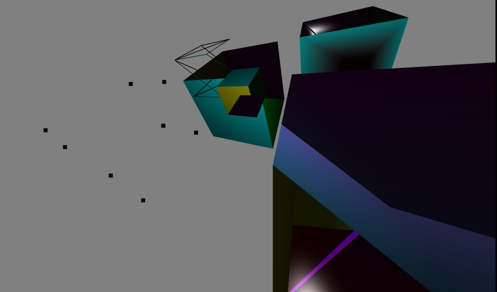

더하여 그런 상황에서 light position이 변경되는 거에 따라서 하나의 cube(물체)에 대해서 light가 동작하는 것이 아니고

좌표공간 전체에 light가 작동하여 5개의 서로다른 cube들에 어떻게 반사하는지를 확인할 수 있게 shading을 구성했습니다.

각 부분들은 실제 tutorial 형식처럼 해당 topic에 대해서 학습한 후 , quiz를 진행하거나 slide bar를 조작 , 또는 버튼을 조작하여 topic에 대한 내용을 실습해 볼 수

 있습니다. 다음 코드부분 이후에 나오는 webgl-html 화면들에 좀 더 자세하게 나와있습니다.

---

## script.js 코드 부분

아래는 translate과 rotate 그리고 scale을 위한 코드부분 입니다.

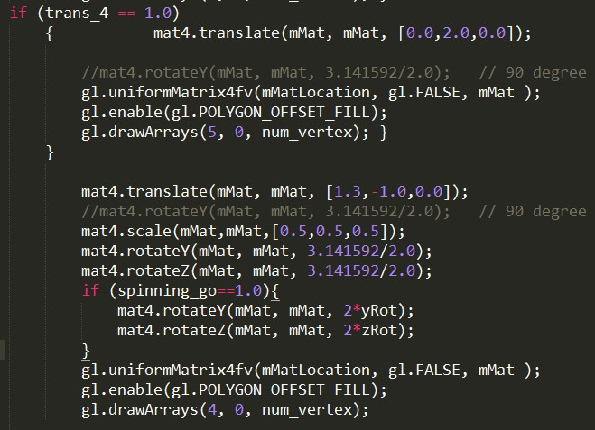

아래는 cam과 translate을 조절하기 위한 변수와 함수의 모음입니다.

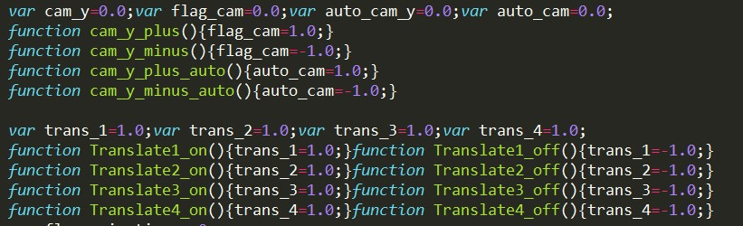

아래는 cam의 auto모드와 수동모드를 조절하기 위한 코드부분 입니다.
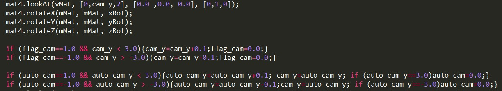

## html 내용 부분
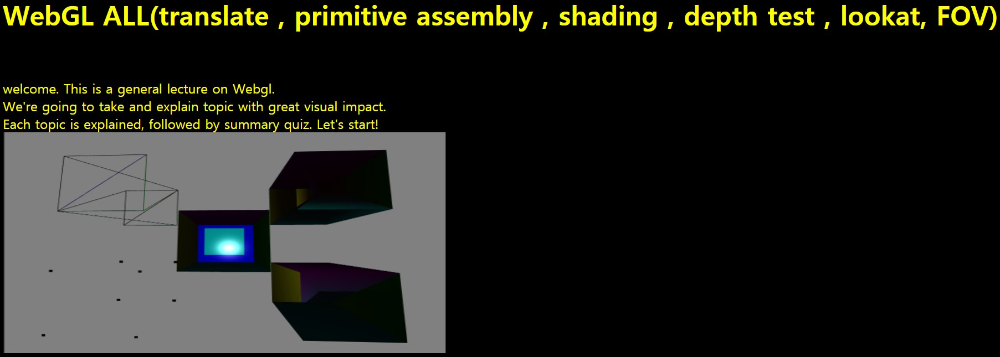
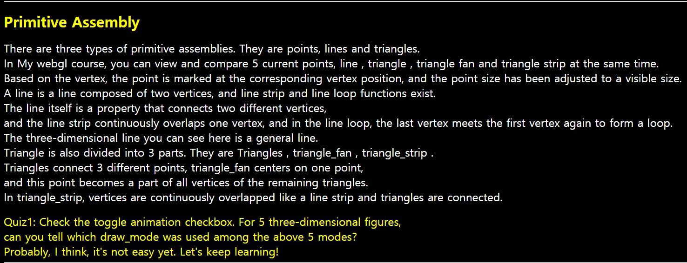
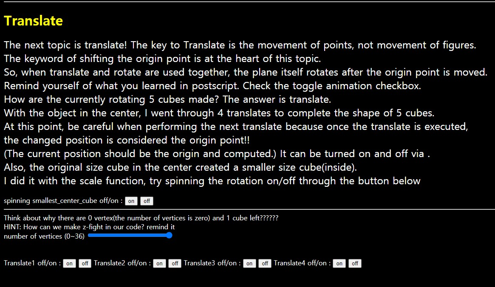
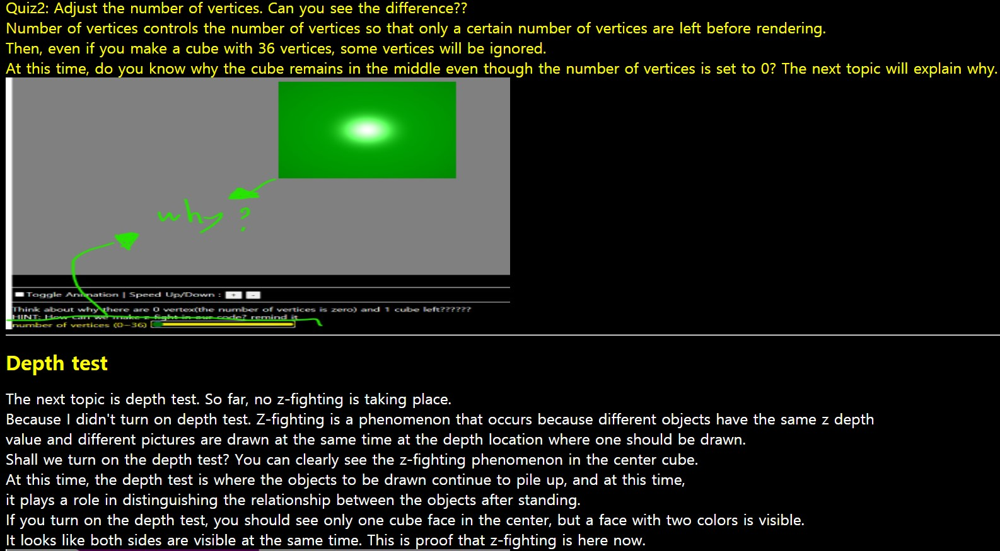
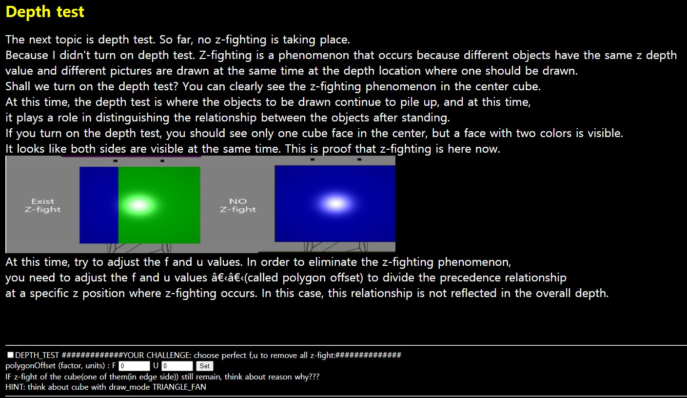
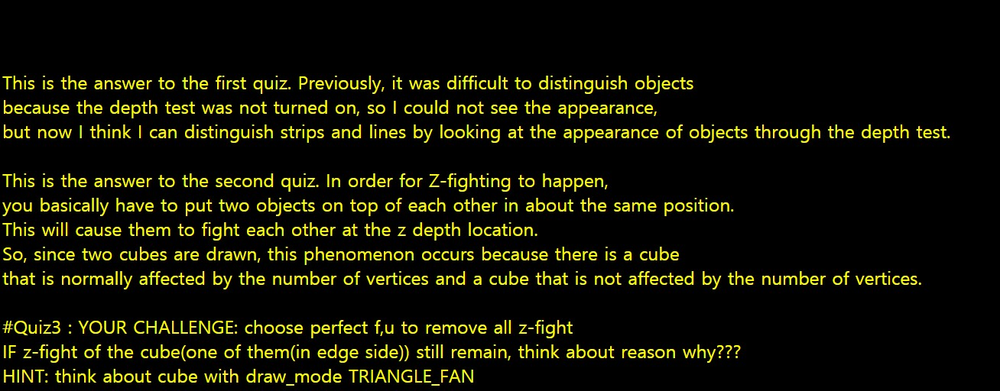
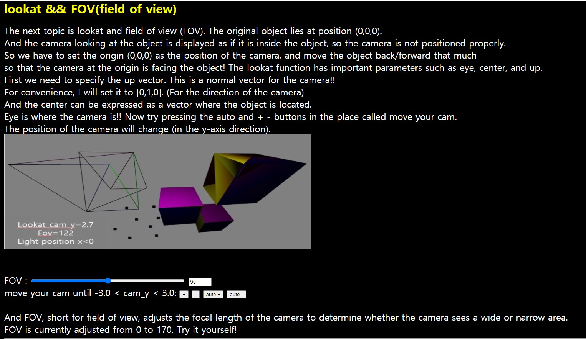
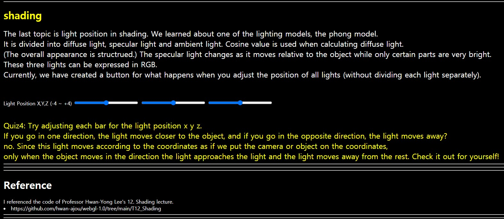

---
## Reference
I referenced the code of Professor Hwan-Yong Lee's 12. Shading lecture.

* https://github.com/hwan-ajou/webgl-1.0/tree/main/T12_Shading

## Baek Jong Seong Project